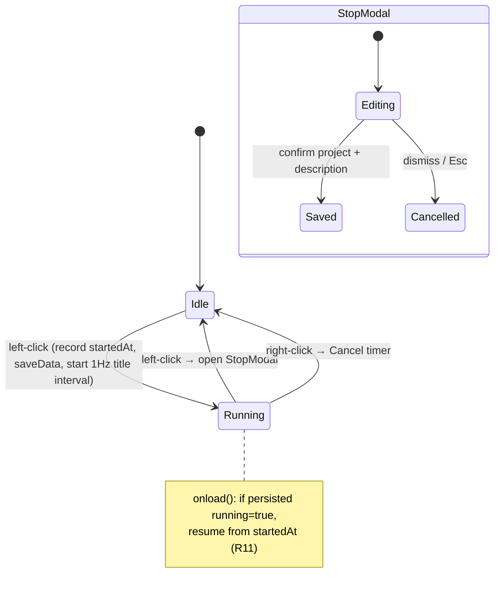

# feat: Menu-Bar Project Time Tracker (Obsidian Plugin)

## Summary

Build a new Obsidian desktop plugin that owns a macOS menu-bar (Electron `Tray`) clock. Left-click toggles a single timer whose live elapsed time shows in the menu bar; stopping opens a modal to confirm the project (pick-existing-or-type-new) and add a description, then writes one markdown session note into the vault. A shipped `.base` file rolls sessions up per project. Reuses Electron-access and icon-rendering code from the author's `obsidian-headless-mode` plugin (both proven in this Obsidian build); the left/right-click wiring is new and confirmed by an early spike.

---

## Problem Frame

Malik tracks no time across his many projects today, and off-the-shelf trackers keep the data in a third-party database rather than his vault. The brainstorm established the shape; this plan covers how to build it. (See origin: `docs/brainstorms/2026-06-23-menubar-time-tracker-requirements.md`.)

---

## Requirements

- R1. Menu-bar icon via Electron `Tray`, mirroring the `obsidian-headless-mode` pattern.
- R2. Left-click toggles the timer (first click starts, next stops and opens the modal); one timer at a time.
- R3. Running timer shows live elapsed time in the menu bar and visibly distinguishes running vs idle.
- R4. Stop opens a modal showing elapsed duration; project confirmation is required before save.
- R5. Project field is a picker of prior projects that also accepts a newly typed name, remembered for next time.
- R6. Modal has a free-text description field.
- R7. Right-click opens a menu with at least: cancel current timer (when running) and open settings.
- R8. Modal can be dismissed without saving — no note written, running state cleared.
- R9. On save, write one note per session into a dedicated vault folder with frontmatter (project, start, end, duration, date) plus description in the body.
- R10. Ship an Obsidian Base that groups sessions by project and sums duration for a live "time per project" view.
- R11. Persist the running timer's start time so an Obsidian restart/crash mid-session does not lose it.

**Origin actors:** A-none (single-actor tool; origin omitted Actors).
**Origin flows:** F1 (track a work session), F2 (cancel a session without logging).
**Origin acceptance examples:** AE1 (covers R2, R3), AE2 (covers R4, R5, R6, R9), AE3 (covers R5), AE4 (covers R8), AE5 (covers R11).

---

## Scope Boundaries

- No idle/away detection or auto-pause.
- No in-modal duration editing — an over-long (e.g. forgotten overnight) session is hand-edited in the note afterward.
- No multiple concurrent/overlapping timers.
- No billing, invoicing, or reporting beyond the Base rollup.
- No mobile support — `isDesktopOnly: true` (Tray is desktop-only).
- Not merged into Headless Mode — ships as its own plugin (code is reused, not the plugin).
- No Windows/Linux menu-bar parity in v1: `Tray.setTitle` is macOS-only, so the live-time-in-menu-bar feature is macOS-first (the timer still functions elsewhere, just without the title readout — see Risks).

### Deferred to Follow-Up Work

- Community-plugin submission/release packaging (BRAT or official registry): separate effort once the plugin is daily-driver stable.

---

## Context & Research

### Relevant Code and Patterns

- `obsidian-headless-mode/main.js` (installed at `Palm/.obsidian/plugins/obsidian-headless-mode/main.js`) — authoritative local pattern to mirror:
  - `getElectronRemote()` — tries `require('electron').remote` then `require('@electron/remote')`. **Proven to work in the user's current Obsidian/Electron build.** Reuse verbatim.
  - `createTrayIcon(remote, color)` — renders a retina (1x/2x) `nativeImage` from a canvas, with `setTemplateImage(true)` for the macOS "auto" tint. Reuse the rendering approach with a clock glyph.
  - Stale-tray cleanup via a `window` global key + `isDestroyed()` guard, and `destroyTray()` in `onunload`. Reuse, but use a **distinct global key** (not `__headlessModeTray`) so the two plugins' trays never collide.
  - `loadData()` / `saveData()` settings merge with `Object.assign({}, DEFAULT_SETTINGS, data)`.
  - Settings tab built with `Setting` + `.addToggle/.addDropdown`.
- **Deliberate divergence from Headless Mode — and the one unproven part:** Headless Mode sets a context menu via `tray.setContextMenu(...)`. Setting a context menu changes the tray's click semantics on macOS (a set menu opens on click, so a custom left-click action won't fire reliably). To get a custom left-click toggle, this plugin must NOT call `setContextMenu`; instead wire `tray.on('click')` (toggle) and `tray.on('right-click')` → `tray.popUpContextMenu(menu)`. **Headless Mode never exercises these event APIs** — it only sets a context menu — so this exact mechanism is the part NOT validated by the cited prior art. Confirm it with an early spike in U2 (see Risks). Only the Electron-access helper and icon rendering are actually proven by Headless Mode.

### Institutional Learnings

- None — new repo, no `docs/solutions/`. The Headless Mode source is the de-facto institutional pattern.

### External References

- Electron `Tray`: `setTitle(title, { fontType: 'monospacedDigit' })` is macOS-only and the standard, leak-free way to show a live menu-bar timer when updated ~1 Hz via `setInterval`. `setContextMenu` suppresses left-click on macOS; use `on('click')` / `on('right-click')` + `popUpContextMenu`.
- Obsidian API (docs.obsidian.md): `Modal` (`onOpen`/`onClose`, `contentEl`); `Setting` with `.addDropdown/.addText/.addTextArea/.addButton`; `AbstractInputSuggest` (stable since 1.4.10) for embedding a "pick-existing-or-type-new" suggester on a text input; `Plugin.loadData/saveData` → `data.json`; `Vault.create`, `Vault.createFolder`, `getAbstractFileByPath`, `normalizePath` for note writing.
- Obsidian sample-plugin layout: `manifest.json`, `main.ts`, `versions.json`, `esbuild.config.mjs`, `tsconfig.json`, `package.json`, optional `styles.css`; `npm run build` → `main.js`. Node ≥ 18.
- Obsidian Bases (`.base` YAML): `groupBy: { property: project }` + `summaries: { duration: Sum }`; scope with `file.inFolder("<folder>")`; formula can format minutes to `Hh Mm` for display.

---

## Key Technical Decisions

- **Reuse Headless Mode's Electron-access + icon code, diverge on click wiring.** Lowest-risk path to a working tray; the unstable `remote` access *and* `new Tray()` construction are already proven in this exact environment (Headless Mode does both). The left/right-click event wiring is the one part Headless Mode does not exercise — it is spike-gated in U2 rather than assumed.
- **No `setContextMenu`; left-click = toggle, right-click = `popUpContextMenu`.** Required to honor R2 (one-click start/stop) on macOS.
- **`Tray.setTitle` with `fontType: 'monospacedDigit'`, updated once per second.** Gives a non-jittering live readout (R3). Idle vs running also reflected in the icon image (e.g. filled vs hollow clock).
- **Store duration as an integer number of minutes** (plus ISO `start`/`end` strings and a `date`) in frontmatter. Integer minutes make the Bases `Sum` summary work directly (R10); display formatting (`Hh Mm`) is a Base formula, not stored. Saved duration is `max(1, round(minutes))` so a real sub-minute session counts as 1 minute rather than `0` (which would silently vanish from the Sum); full-fidelity ISO `start`/`end` are always stored too. Elapsed is **wall-clock** (`end − start`), so sleep, clock changes, and DST are reflected as-is — an anomalous value is hand-edited, same posture as the forgotten-overnight case (see Risks).
- **Known-projects list persisted in `data.json`** (`knownProjects: string[]`), updated on each save. Chosen over deriving from `metadataCache` because it is simple, deterministic, and survives note deletion. Resolves origin's R5-storage open question. All persisted fields (timer state, `knownProjects`, folder setting) live on a single in-memory settings object that every `saveData` serializes whole, so interleaved saves can't drop a field.
- **Session folder is a configurable setting** with a sensible default (`Time Log/Sessions`), created on demand via `getAbstractFileByPath` + `createFolder`. Avoids hardcoding a Johnny-Decimal path; user can point it at any vault location.
- **Filename scheme `YYYY-MM-DD HHmm <project>.md`** with a numeric collision suffix (` 2`, ` 3`, …) when the path already exists. Human-scannable and collision-safe.
- **Pure logic extracted into Obsidian-free modules** (`src/format.ts`, `src/session.ts`) so it is unit-testable with `vitest`; Obsidian/Electron-coupled code (tray, modal, vault) stays thin and is manually verified in Obsidian. There is no headless Obsidian test harness, so this split is what makes meaningful automated testing possible.

---

## Open Questions

### Resolved During Planning

- Known-projects storage (origin deferred): persist in `data.json`. See Key Technical Decisions.
- Session folder + filename scheme (origin deferred): configurable folder defaulting to `Time Log/Sessions`; `YYYY-MM-DD HHmm <project>.md` with collision suffix.
- Whether the plugin generates the `.base` or ships it (origin deferred): ship a static `assets/Time per project.base`; on first load, if absent at the configured location, copy it in with the `file.inFolder(...)` filter **templated to the current session-folder setting**, never overwriting an existing file. If the folder setting later changes, show a `Notice` that the Base still points at the old folder. This removes the stale-filter failure mode three reviewers flagged.
- `Tray.setTitle` live-update safety (origin deferred): confirmed safe at ~1 Hz with `monospacedDigit`.

### Deferred to Implementation

- Exact clock-glyph canvas path for idle vs running icons — finalize visually during implementation (mirror `createTrayIcon` drawing approach).
- Precise `AbstractInputSuggest` subclass wiring (method signatures) — settle against the installed `obsidian` type defs at code time.
- Whether to debounce `saveData` on start/stop — decide if profiling shows churn; functionally one write per start and per stop is fine.

---

## Output Structure

    obsidian-time-tracker/
    ├── manifest.json
    ├── versions.json
    ├── package.json
    ├── tsconfig.json
    ├── esbuild.config.mjs
    ├── styles.css
    ├── vitest.config.ts
    ├── src/
    │   ├── main.ts              # Plugin class: lifecycle, tray, wiring
    │   ├── tray.ts              # Tray creation, icon rendering, click wiring
    │   ├── timer.ts             # Timer state machine + live-title interval
    │   ├── stop-modal.ts        # Stop modal + inlined AbstractInputSuggest subclass
    │   ├── session.ts           # Pure: frontmatter build, filename, collision (Obsidian-free)
    │   ├── format.ts            # Pure: elapsed → tray string, minutes → human (Obsidian-free)
    │   ├── writer.ts            # Vault note writing (folder ensure, create)
    │   ├── settings.ts          # Settings tab + DEFAULT_SETTINGS
    │   └── electron-tray.ts     # getElectronRemote() helper (reused from Headless Mode)
    ├── assets/
    │   └── Time per project.base
    └── tests/
        ├── format.test.ts
        └── session.test.ts

*Scope declaration, not a constraint — the implementer may merge/split modules if a cleaner layout emerges. Per-unit `Files` lists are authoritative.*

---

## High-Level Technical Design

> *This illustrates the intended approach and is directional guidance for review, not implementation specification. The implementing agent should treat it as context, not code to reproduce.*

Timer lifecycle:

On `Saved`, the writer composes the session note (pure `session.ts` builds frontmatter + filename) and `vault.create`s it; the timer/elapsed state is cleared **only after** `vault.create` resolves successfully, so a failed write (permissions, disk full) keeps the elapsed time and re-presents the modal for retry rather than losing the session. On `Cancelled` or `Cancel timer`, state is cleared immediately and no note is written. Every exit stops the 1 Hz title interval. While the modal is open, a `modalOpen` flag makes tray left-click and the menu's Cancel-timer item inert — the modal owns the interaction.

---

## Implementation Units

- U1. **Plugin scaffold and build toolchain**

**Goal:** A buildable, loadable empty Obsidian plugin in the repo.

**Requirements:** Enables R1–R11 (foundation).

**Dependencies:** None.

**Files:**
- Create: `manifest.json`, `versions.json`, `package.json`, `tsconfig.json`, `esbuild.config.mjs`, `styles.css`, `vitest.config.ts`, `src/main.ts` (skeleton `Plugin` with `onload`/`onunload`), `.gitignore`
- Test: none for this unit

**Approach:**
- Base on the official sample-plugin layout. `manifest.json`: `id` (lowercase-hyphen, not ending in "plugin", not containing "obsidian" — e.g. `menubar-time-tracker`), `name`, `version` `0.1.0`, `minAppVersion`, `description`, `author` "Meirakami", `authorUrl` the powderfirm GitHub, `isDesktopOnly: true`.
- `esbuild.config.mjs` bundles `src/main.ts` → `main.js` (CJS, external `obsidian`/`electron`). `package.json` scripts: `dev` (watch), `build`, `test` (vitest).
- `versions.json` maps `0.1.0` → chosen `minAppVersion`.

**Patterns to follow:** `obsidian-headless-mode` manifest/structure; official `obsidian-sample-plugin`.

**Test scenarios:** Test expectation: none — scaffolding/config only. Verification is build + load.

**Verification:** `npm run build` emits `main.js`; copying `main.js`+`manifest.json` into a vault's `.obsidian/plugins/<id>/` loads with no console errors and the plugin appears enabled.

---

- U2. **Electron tray bootstrap and click wiring**

**Goal:** A menu-bar clock icon that distinguishes left-click (toggle callback) from right-click (menu), with clean teardown.

**Requirements:** R1, R3 (idle/running icon), R7 (menu surface).

**Dependencies:** U1.

**Files:**
- Create: `src/electron-tray.ts` (reused `getElectronRemote()`), `src/tray.ts`
- Modify: `src/main.ts` (instantiate tray in `onload`, destroy in `onunload`)
- Test: none (Electron-coupled; manually verified)

**Approach:**
- Port `getElectronRemote()` verbatim from `obsidian-headless-mode/main.js`. Guard `Platform.isDesktopApp`; if remote unavailable, log and disable.
- Port `createTrayIcon` rendering; draw a clock glyph as a macOS **template image** (auto-tinted by the system) with two states — idle (hollow) vs running (filled). No user-facing icon-color setting (cut as unneeded — see U6).
- **Do not call `setContextMenu`.** Wire `tray.on('click', onToggle)` and `tray.on('right-click', () => tray.popUpContextMenu(buildMenu()))`. **Spike this first:** Headless Mode never exercises these event APIs, so confirm in the target Obsidian build that left-click and right-click fire distinctly before building U3 on top. If they don't, fall back to a `setContextMenu` Start/Stop item.
- Stale-tray cleanup using a **distinct** `window` global key (e.g. `__menubarTimeTrackerTray`) + `isDestroyed()`; `destroyTray()` in `onunload`.
- `buildMenu()` returns the right-click menu (items wired in U3/U6: Cancel timer [enabled when running], Settings). Stub callbacks for now.

**Execution note:** Start with the click-wiring spike above — it is the riskiest unproven assumption in the plan; everything in U3 depends on it.

**Patterns to follow:** `createTray`/`refreshTrayMenu`/`destroyTray` in `obsidian-headless-mode/main.js` — adapted to event-based clicks.

**Test scenarios:**
- Integration (manual): left-click fires the toggle callback (logged); right-click opens the menu; both icons (Headless + this) coexist without one destroying the other; disabling the plugin removes the icon.

**Verification:** Icon appears in the menu bar on load; left vs right click are distinguishable; `onunload` leaves no orphaned icon.

---

- U3. **Timer state machine, live title, and persistence**

**Goal:** One-at-a-time start/stop with a live menu-bar readout that survives restart.

**Requirements:** R2, R3, R11.

**Dependencies:** U2.

**Files:**
- Create: `src/timer.ts`, `src/format.ts` (pure)
- Modify: `src/main.ts` (own timer instance; wire tray toggle → `timer.toggle()`), `src/tray.ts` (expose `setTitle`/`setRunningIcon`)
- Test: `tests/format.test.ts`

**Approach:**
- `format.ts` (pure): `formatTrayElapsed(ms)` → `M:SS` under an hour, `H:MM:SS` at/over an hour; `formatHuman(minutes)` → `Xm` / `Hh MMm`; `minutesBetween(startISO, endISO)` rounding to nearest minute.
- `timer.ts`: holds `{ running, startedAt }`; `start()` records `Date.now()`, persists via `saveData`, starts a 1 Hz interval calling `tray.setTitle(formatTrayElapsed(...), {fontType:'monospacedDigit'})` and swaps to the running icon; `stop()` clears the interval, computes elapsed, returns it, and leaves persistence clearing to the caller after the write succeeds (see U5); `cancel()` clears state + persistence + interval, no elapsed returned.
- `toggle()` early-returns while a `modalOpen` flag is set (set/cleared by U4's modal), so clicking the tray during the stop modal does nothing.
- On `onload`, after `loadData`, if `running` was persisted, **immediately** render the title + running icon once (before the first interval tick, so a resumed session is visible instantly) and resume the 1 Hz interval from the stored `startedAt` (R11). If the resumed elapsed exceeds a staleness threshold (e.g. 8h), show a `Notice` so a crash-and-reopen-much-later timer isn't silently trusted.
- Register an Obsidian command "Toggle timer" (`addCommand`) mirroring the tray left-click — a discoverability/accessibility fallback if the menu-bar icon is hidden behind the notch or menu-bar overflow.
- Register the interval with `registerInterval` so Obsidian clears it on unload.

**Patterns to follow:** `loadSettings`/`saveSettings` persistence in `obsidian-headless-mode/main.js`.

**Test scenarios:**
- Happy path: `formatTrayElapsed(42*60*1000)` → `42:00`; `formatTrayElapsed(3*3600*1000+125000)` → `3:02:05`.
- Edge: `formatTrayElapsed(0)` → `0:00`; exactly `3600*1000` flips to `1:00:00`.
- Edge: `minutesBetween` rounds 89 s → 1 min, 91 s → 2 min; same start/end → 0.
- Edge (`formatHuman`): `0`→`0m`, `42`→`42m`, `63`→`1h 03m`, `840` (forgotten overnight ~14h)→`14h 00m`.
- Covers AE1 (manual): from idle, left-click starts the timer and the menu bar begins counting.
- Covers AE5 (manual): start, quit + reopen Obsidian → timer resumes from the original start, not reset, and the title renders immediately on load.
- Edge (manual): resuming a timer whose elapsed exceeds the staleness threshold shows a `Notice`.
- Integration (manual): the "Toggle timer" command starts/stops the timer identically to a tray left-click.

**Verification:** Live title increments each second without horizontal jitter; running/idle icons differ; restart mid-run resumes elapsed and is visible at once.

---

- U4. **Stop modal with project suggester and description**

**Goal:** On stop, collect a confirmed project (pick-or-type-new) and description, or cancel cleanly.

**Requirements:** R4, R5, R6, R8.

**Dependencies:** U3.

**Files:**
- Create: `src/stop-modal.ts` (with the `AbstractInputSuggest` subclass inlined as a local class — no separate file)
- Modify: `styles.css` (modal layout)
- Test: none (Obsidian UI-coupled; manually verified — pure project-list logic lives in U5/`session.ts`)

**Approach:**
- `StopModal extends Modal`, constructed with elapsed ms + `knownProjects` + an `onSubmit({project, description})` / `onCancel` pair. Sets a `modalOpen` flag on open and clears it on close (consumed by U3's toggle guard and U6's menu).
- Render with `Setting`: a text input with a **local** `AbstractInputSuggest` subclass (implement `getSuggestions(query)` filtering `knownProjects`, `renderSuggestion(value, el)`, and `selectSuggestion(value)` to fill the field); a freshly typed name is allowed. Give the input `.setPlaceholder('Project name')` so the empty first-run state is unambiguous — the dropdown simply shows nothing when `knownProjects` is empty. A `addTextArea` for description. `addButton` Save (`.setCta()`) and Cancel.
- Display elapsed via `formatHuman` at the top (read-only; no editing per scope).
- Save requires a non-empty project (Save inert until set) → R4. Track a `submitted` flag set by Save; `onClose` routes to `onCancel` whenever `submitted` is false — covering Esc, the Cancel button, and click-away → R8.

**Patterns to follow:** Obsidian `Modal` + `Setting` docs; `AbstractInputSuggest` reference.

**Test scenarios:**
- Covers AE2 (manual): after a 42 min run, modal shows "42m"; choosing "Yonder" + a description + Save invokes `onSubmit` with those values.
- Covers AE3 (manual): typing a brand-new project name and saving passes the new name to `onSubmit`.
- Covers AE4 (manual): dismissing via Esc/Cancel invokes `onCancel`, not `onSubmit`.
- Edge (manual): Save is inert while the project field is empty.
- Edge (manual): with an empty `knownProjects`, the field shows the placeholder and no dropdown panel.

**Verification:** Suggester lists prior projects and accepts new ones; Save only with a project; dismiss writes nothing.

---

- U5. **Session note writer and known-projects update**

**Goal:** Persist a confirmed session as a markdown note and remember its project.

**Requirements:** R9, R5 (persistence of new project).

**Dependencies:** U4.

**Files:**
- Create: `src/session.ts` (pure), `src/writer.ts`
- Modify: `src/main.ts` (on modal submit: build → write → update `knownProjects` → `saveData`; clear timer persistence)
- Test: `tests/session.test.ts`

**Approach:**
- `session.ts` (pure, Obsidian-free): `saveMinutes(startISO, endISO)` → `max(1, round(minutesBetween(...)))`; `buildFrontmatter({project,startISO,endISO,minutes,date})` → YAML string (quote project safely); `buildBody(description)`; `buildFilename(date, time, project)` → `YYYY-MM-DD HHmm <project>.md` sanitized for filesystem; `nextAvailablePath(folder, filename, exists)` → appends ` 2`,` 3`… using an injected `exists(path)` predicate (keeps it pure/testable); `addKnownProject(list, name)` → deduped, trimmed.
- `writer.ts`: ensure folder via `getAbstractFileByPath` + `createFolder` (using `normalizePath`); resolve a collision-free path with `nextAvailablePath` backed by `vault.getAbstractFileByPath`; `vault.create(path, frontmatter+body)`.
- **Sequencing (no data loss):** call `vault.create` first; only on success update `knownProjects`, `saveData`, clear the timer/elapsed state, and fire `new Notice('Session saved — <project>, <formatHuman(minutes)>')`. On failure, show an error `Notice` and keep the elapsed/timer so the modal can be retried.
- Frontmatter fields: `project` (string), `start`/`end` (ISO), `duration` (integer minutes, floored to 1 via `saveMinutes`), `date` (`YYYY-MM-DD`). Description in body.

**Patterns to follow:** Obsidian Vault API (`create`/`createFolder`/`getAbstractFileByPath`/`normalizePath`).

**Test scenarios:**
- Covers AE2: `buildFrontmatter` emits `duration: 42` (integer) and matching ISO `start`/`end`; body contains the description.
- Edge: `saveMinutes` for a 25-second session → `1` (floored), not `0`; for 42 min → `42`.
- Covers AE3: `addKnownProject(["Yonder"], "Boyfrnd.")` → includes "Boyfrnd."; adding a duplicate (case/whitespace) does not double it.
- Happy path: `buildFilename(...)` → `2026-06-23 1432 Yonder.md`.
- Edge: project with a `/` or `:` is sanitized to a safe filename but the frontmatter `project` keeps the original.
- Edge: `nextAvailablePath` returns the base path when `exists` is always false; appends ` 2` when the base exists, ` 3` when base and ` 2` exist.
- Edge: empty/whitespace description yields a note with frontmatter and an empty body (no crash).

**Verification:** Saving creates a note in the configured folder with correct frontmatter and body; a same-minute second session gets a suffixed filename; new projects appear in the next modal's suggester.

---

- U6. **Right-click menu, settings tab, and Bases rollup asset**

**Goal:** Cancel/settings reachable from the menu bar, configurable behavior, and a per-project rollup view.

**Requirements:** R7, R10; supports R5/R9 config.

**Dependencies:** U2 (menu infrastructure / buildMenu stubs), U3 (cancel needs timer state), U5 (folder setting feeds writer).

**Files:**
- Create: `src/settings.ts`, `assets/Time per project.base`
- Modify: `src/tray.ts` / `src/main.ts` (populate right-click menu), `src/main.ts` (ship `.base` on first load if absent)
- Test: none for the tab/menu (UI-coupled); the `.base` is verified in Obsidian

**Approach:**
- Right-click menu (`popUpContextMenu`): "Cancel timer" (enabled only when running **and** no modal open → `timer.cancel()`, R7/R8 via F2), "Settings" (opens the settings tab), and an optional "Start/Stop timer" mirror item. Rebuild per open so enabled-state reflects current `timer.running` and `modalOpen`.
- `settings.ts` (`PluginSettingTab` + `DEFAULT_SETTINGS`): **only** the session folder path (default `Time Log/Sessions`). The icon-color and seed-projects settings were cut as unneeded — no requirement drives them; the icon uses a fixed macOS template image and `knownProjects` is populated entirely by saving sessions.
- `assets/Time per project.base`: table view, `filters: file.inFolder("<sessionFolder>")`, `groupBy: { property: project, direction: ASC }`, `summaries: { duration: Sum }`, plus a formula `total_h: '(duration / 60).round(2)'` for an hours column. On first load, if absent at the configured location, copy it in with the `file.inFolder(...)` filter **templated to the current session-folder setting**, never overwriting an existing file. If the folder setting later changes, fire a `Notice` that the Base still points at the old folder, so the rollup never silently goes empty.

**Patterns to follow:** `HeadlessModeSettingTab` in `obsidian-headless-mode/main.js`; `obsidian-bases` skill schema (groupBy + summaries + formula).

**Test scenarios:**
- Integration (manual): with a timer running, right-click → "Cancel timer" stops it and writes no note (F2); when idle, that item is disabled/absent; while the stop modal is open, it is disabled.
- Integration (manual): changing the session folder in settings makes the next session write to the new folder and fires a `Notice` that the Base filter is stale.
- Integration (manual): opening `Time per project.base` groups sessions by project and shows summed duration (and hours formula) per group.

**Verification:** Menu reflects current running state; settings persist via `saveData`; the Base renders per-project totals.

---

## System-Wide Impact

- **Interaction graph:** Two Obsidian plugins now create Electron `Tray` objects (Headless Mode + this). They must use distinct `window` global keys and independent lifecycles; neither should destroy the other's tray.
- **Error propagation:** Electron-remote unavailability disables the plugin gracefully (log + no tray), mirroring Headless Mode. Vault-write failures surface an Obsidian `Notice` and **retain** the elapsed time / re-present the modal for retry rather than clearing state, so a failed write never loses the session.
- **State lifecycle risks:** A persisted `running` flag with a stale `startedAt` after a crash is intended (resume, R11); a forgotten overnight timer is acceptable by scope (hand-edit). Ensure the title interval is cleared on `onunload` and modal-resolution to avoid leaks.
- **API surface parity:** None — no public API exported.
- **Unchanged invariants:** Headless Mode is untouched; its tray/global key and behavior must remain exactly as-is.

---

## Risks & Dependencies

| Risk | Mitigation |
|------|------------|
| Electron `remote`/`@electron/remote` access is undocumented and Obsidian has signaled future plugin sandboxing | Isolate all Electron access in `src/electron-tray.ts`; reuse the exact helper already working in the user's build; `isDesktopOnly: true`; accept as a known, monitored risk. |
| Left/right-click tray wiring is new and unproven in this build (Headless Mode only uses `setContextMenu`, never the click events) | Spike the click wiring first in U2 before building U3 on it; fall back to a `setContextMenu` Start/Stop if the event APIs don't fire as expected. |
| `Tray.setTitle` is macOS-only — no live readout on Windows/Linux | macOS-first by scope; guard the call so non-macOS still runs the timer and writes notes (just without the menu-bar title). |
| Wall-clock elapsed inflates on sleep / clock change / DST | Accepted, documented behavior: duration is `end − start` wall-clock; anomalies are hand-edited like the overnight case. A staleness `Notice` on resume catches the worst case (crash-and-reopen-much-later). |
| Sub-minute sessions would round to zero and vanish from the Base Sum | Saved duration floored to 1 minute (`saveMinutes`); full-fidelity ISO `start`/`end` retained regardless. |
| Bases is a newer feature; `.base` schema could shift | Ship a minimal table view; it is plain YAML the user can edit; rollup is a convenience over the source-of-truth notes. |
| Two trays / global-key collision with Headless Mode | Distinct global key + independent destroy; explicit in U2. |

---

## Sources & References

- **Origin document:** [docs/brainstorms/2026-06-23-menubar-time-tracker-requirements.md](docs/brainstorms/2026-06-23-menubar-time-tracker-requirements.md)
- Local pattern: `obsidian-headless-mode/main.js` (installed in the Palm vault) — Electron access, tray icon rendering, persistence, settings tab.
- Electron Tray API (setTitle/monospacedDigit, click vs right-click, popUpContextMenu, setContextMenu macOS suppression).
- Obsidian API: Modal, Setting, AbstractInputSuggest, Plugin.loadData/saveData, Vault.create/createFolder/getAbstractFileByPath/normalizePath; official sample-plugin layout.
- Obsidian Bases `.base` schema (`obsidian-bases` skill): groupBy + summaries + formulas.
